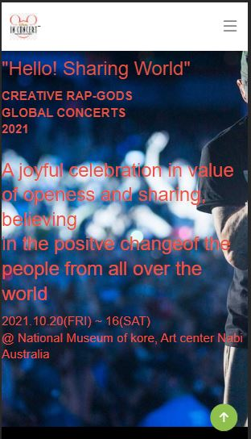
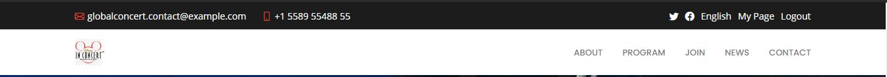
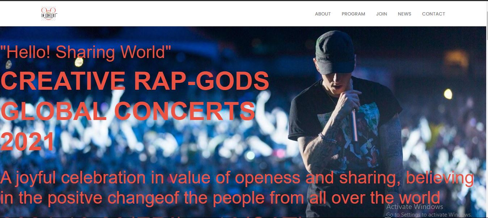

# Html-Css-Capstone-GlobalConcert

This capstone project is to build for the HTML &amp; CSS Technical Microverse curriculum based on an online website for a conference. I am to follow the given design of the website, but I must personalise the content, i.e., instead of a conference you can build a website for a concert or for a web development course.

## Week 1  HTML5 Collaborative Microverse Project

This project was created as a clone of the New York Times - Article Page.
The collaborative Coding experience was an amazing experience, spending time and holding each other accountable  to learn and  create this project from ground was fun. I was sure to complete the project and understan every bits in details.

This project was my  first experience with the use of linters, which was great and understandable.

>Skills Revived & Learned:

- Versioning & best practices of maintaining branches of safe deployed and local dev
- git flow & Github flow
- HTML, CSS new and better elements, semantics, features etc
- Cloning - the hard work and skills needed to successfully make a clone.
- Linter - install & fix tests {still not managed to get styleint to run on VSC locally}
- Collaborative learning, being patient, helping each other succeed.
- Attending Daily standup, being focused, accountable.

>## Learning Goals

- Version Control & CSS
- Introduction to HTML & CSS concepts.
- Position, Flex, Floats
- Embeds and image manipulating
  
>## Screen Shots

[Link to page designs of the site for capstone ]
(https://www.behance.net/gallery/29845175/CC-Global-Summit-2015)

>## Built With

- Major languages: HTML, CSS
- Frameworks: git flow, CSS framework (Bootstrap for responsiveness)
- Technologies used: None

>## Live Demo

  [Link Github Repo](https://github.com/errea)

  [Live Demo Link](https://hardcore-hodgkin-3a83ed.netlify.app/)

>### Getting Started

To get a local copy up and running follow these simple example steps.

## Prerequisites

1. Vs code

2. Terminal (Bash)

3. Linter tests

## Setup

Setup by  following the installation instructions below

## Install

 Run this npm package to install dependencies

 => npm install --save-dev hint@6.0.x

 Run npx hint . [To fix Webhint errors]

 => npm install --save-dev stylelint@13.3.x

Run npx stylelint "**/*.{css,scss}" --fix [ To fix Stylint error]

 stylelint-scss@3.17.x stylelint-config-standard@20.0.x stylelint-csstree-validator

### Run tests

run test with linters
=> Webhint
=> Stylelint
=> Lighthouse

### Deployment

Deloped  project using Netlify 
[Live Demo Link](https://hardcore-hodgkin-3a83ed.netlify.app/)

## Authors

👤 **Eri-Ngozi**

- GitHub: [@githubhandle](https://github.com/errea)
- Twitter: [@twitterhandle](https://twitter.com/Erreakay)
- LinkedIn: [LinkedIn](https://www.linkedin.com/in/eri-ngozi-okereafor/)

## 🤝 Contributing

Contributions, issues, and feature requests are welcome!

Feel free to check the [issues page](issues/).

## Show your support

Give a ⭐️ if you like this project!

## Acknowledgments

- Hat tip to anyone whose code was used
- Inspiration
- etc

## 📝 License

This project is [MIT](https://mit-license.org/) licensed
