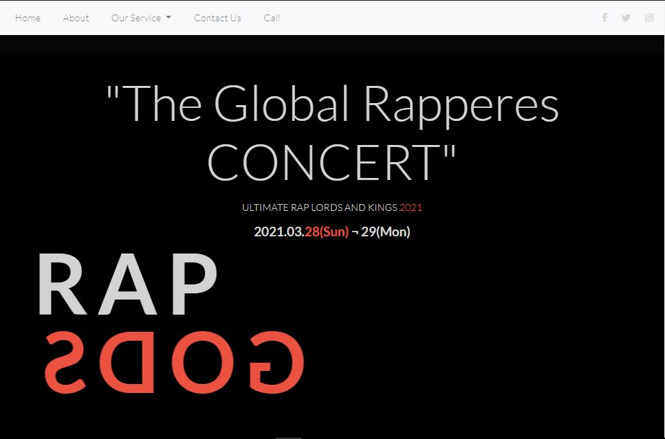
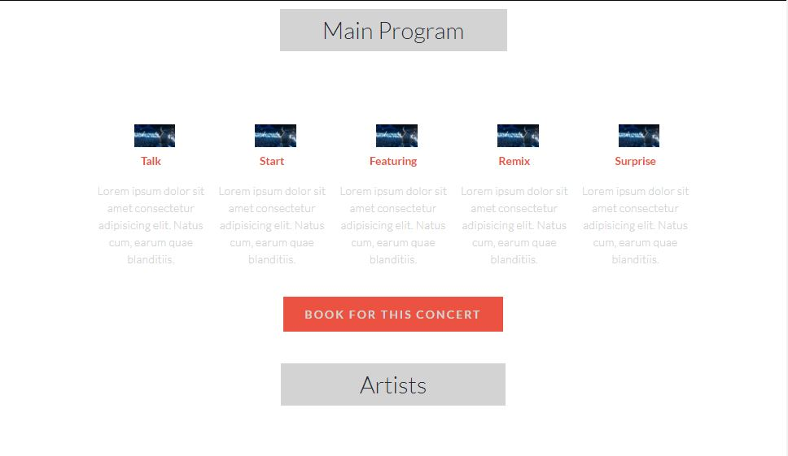
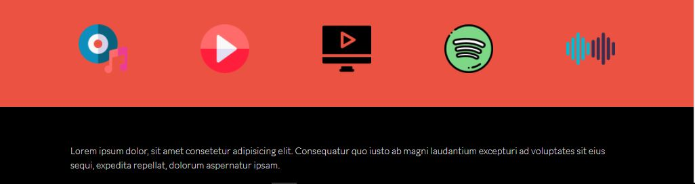
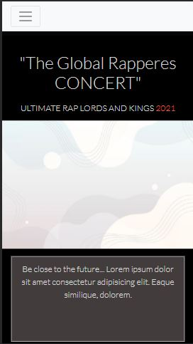
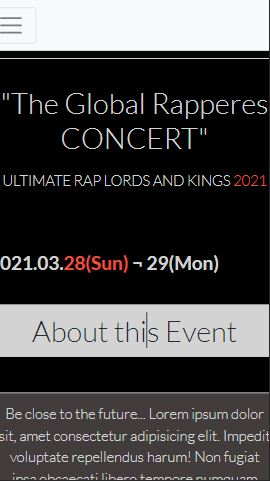
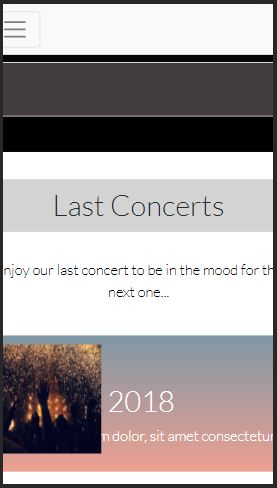

# Html-Css-Capstone- Music Global Concert

This capstone project is designed to meet the HTML CSS Technical Microverse curriculum based on an online website for a conference. I am to follow the given design of the website, but I must personalise the content and be creative, i.e., instead of a conference concert I decided to build a Music concert.

## Week 4  HTML/CSS  Microverse Capstone Project

This project was created to reflect the RWD pattern for website. I had to start with the mobile responsiveness.
The project was solo but at the same time I had my coding partner and I working for accounttabuility and ideas. I was sure to complete the project and understand every bit of the details.

>Skills Revived & Learned:

- Versioning & best practices of maintaining branches of safe deployed and local dev
- Git flow & Github flow Practice
- HTML, CSS semantics, features  and best practice (DRY)etc
- Using CSS framework like Bootstrap for RWD
- Cloning - the hard work and skills needed to successfully make a clone.
- Linter - install & fix tests {still not managed to get styleint to run on VSC locally}
- Collaborative learning, being patient, helping each other succeed.
- Attending Daily standup, being focused, accountable.

>## Learning Goals

- Version Control & CSS
- Introduction to HTML & CSS concepts.
- Position, Flex, Floats
- Embeds and image manipulating
  
>## Screen Shots

## These Images are outdated pls check the link to the live demo

[Link to page designs of the site for capstone ]
(https://www.behance.net/gallery/29845175/CC-Global-Summit-2015)

>## Built With

- Major languages: HTML, CSS
- Frameworks: git flow, CSS framework (Bootstrap for responsiveness)
- Technologies used: None

>## Live Demo

## Link to Github Repository

  [Link Github Repo](https://github.com/errea)

## Link to Live Demo

  [Live Demo Link](https://agitated-brattain-a67def.netlify.app/)

>### Getting Started

To get a local copy up and running follow these simple example steps.

## Prerequisites

     Vs code
     Terminal (Bash)
     Linter tests

## Setup

Setup by  following the installation instructions below

## 1.  Installations

Clone the git repository on your Local machine on your terminal

    git clone https://github.com/errea/Html-Css-Capstone-GlobalConcert.git

## 2.  Installations

 Run this npm package to install dependencies

    npm install --save-dev hint@6.0.x

     npm install --save-dev stylelint@13.3.x

     stylelint-scss@3.17.x stylelint-config-standard@20.0.x stylelint-csstree-validator

 Run this command to fix Webhint errors & stylelint errors Respectivly

       npx hint .

       npx stylelint "**/*.{css,scss}" --fix

### Run tests

run test with linters
=> Webhint
=> Stylelint
=> Lighthouse

>## Deployment 

1. Deloped  project using Netlify
[Live Demo Link](https://agitated-brattain-a67def.netlify.app/)

 I was asked to review the structure of the website as required by Microverse design
  [Link to Loom Video](https://www.loom.com)

>## Authors

👤 **Eri-Ngozi**

- GitHub: [@githubhandle](https://github.com/errea)
- Twitter: [@twitterhandle](https://twitter.com/Erreakay)
- LinkedIn: [LinkedIn](https://www.linkedin.com/in/eri-ngozi-okereafor/)

******** 🤝 Contributing 🤝************

Contributions, issues, and feature requests are welcome!

Feel free to check the [issues page](issues/).

## Show your support

Give a ⭐️ if you like this project!

## Acknowledgments

- Hat tip to anyone whose code was used
- Inspiration
- etc

## 📝 License

This project is [MIT](https://mit-license.org/) licensed
